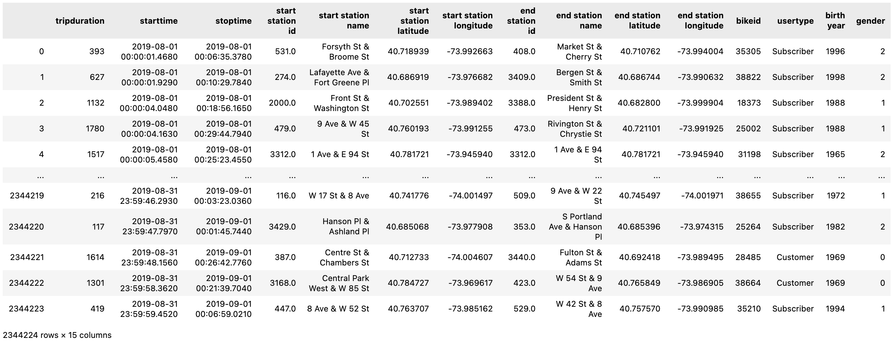

# BikeSharing

On this project, I am helping out Kate on her business proposal regarding to a proof of concept for a business. To convince investors that a bike-sharing program in Des Moines is a solid business proposal, to solidify the proposal, one of the key stakeholders would like to see a bike trip analysis. Below is a quick display of data we had.

Results: Using the visualizations you have in your Tableau Story, describe the results of each visualization underneath the image.

Summary: Provide a high-level summary of the results and two additional visualizations that you would perform with the given dataset.