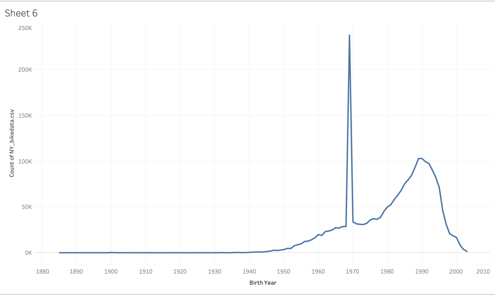

# BikeSharing

On this project, I am helping out Kate on her business proposal regarding to a proof of concept for a business. To convince investors that a bike-sharing program in Des Moines is a solid business proposal, to solidify the proposal, one of the key stakeholders would like to see a bike trip analysis. Below is a quick display of data we had.

# Results:
<a href="https://public.tableau.com/app/profile/sevda.pruitt/viz/CompleteVisualsoftheChallenge/BikeShareProjectVisuals">Tableau Portfolio Link<a/>

Below is the display for the shortest bike checkout times of zero, one, or two minutes, less than a minute has the highest peak.
 

 
This heatmap shows the trips over a week which hours are the most popular or used. During the week, mostly the commute times and during the weekend it is the afternoons that are the most common times as it displays in darker intensity below.

 
The heatmap below is grouped by user type; customer and subscriber over user trips by gender throughout the week timeline.
 

Summary: 
Below the data is grouped by all gender all ages in regard to number of bike checkouts.
 

 
Below is a visual to show all gender types checkout times for users.
 

 
This visual below showing data by gender and birth year.

